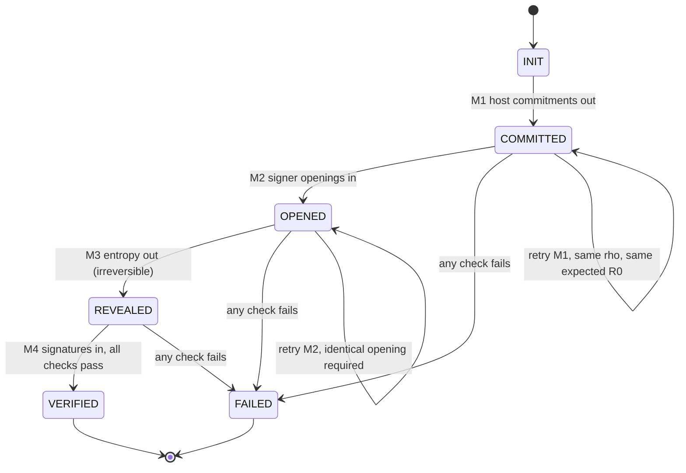

# Interactive anti-exfil: transport-neutral semantic state machine

**Revision 2.** Restructured to the outline proposed by FractalEncrypt, and
updated for everything settled since revision 1: the exact-signature binding
invariant, host entropy source guardrails, and deterministic derivation being
ruled unresolved rather than an alternative to persistence.

**Status:** shared draft. Not owned by either implementation. Points marked
**OPEN** are questions, not decisions. Where a preference is stated it is
labelled as one.

---

## 1. Scope and explicit exclusions

This document defines the semantics of an interactive sign-to-contract
anti-exfil exchange: what the messages mean, what each party must check, and
what "verified" requires. ECDSA over secp256k1 only.

Transport identifiers, uniform resource encoding, PSBT key numbers, wire
framing and device user-interface behaviour are **out of scope**. Each transport
profile proves separately that it carries the semantic fields required here.

Anti-exfil does not protect against, and this document does not cover:

- **Schnorr and taproot.** No sign-to-contract construction exists for BIP-340
  in secp256k1-zkp or libwally. Out of scope for version 1, and no semantics are
  reserved for it — reserving structure for an unevaluated construction is
  specifying against a guess.
- **Address substitution.** Verified on the signer's own display.
- **A malicious coordinator.** This protects the user from the signer. A
  compromised coordinator has easier options.
- **Supply-chain compromise of hardware** beneath honest firmware.
- **Transport confidentiality or authenticity.** Whatever the carriage provides.
- **Whether the correct transaction was constructed.** Only that the signature
  over it did not steer its nonce.

---

## 2. Terminology and roles

**Coordinator.** Generates entropy, enumerates slots, verifies, and is the only
party that can declare a session verified.

**Signer.** Holds the key. Required to be stateless across messages (§7.1).

**Slot.** One signature, by one key, over one input. See §3.

**rho.** Coordinator entropy for a slot. 32 bytes, uniformly random, independent
per slot.

**Host commitment.** `tagged_hash("s2c/ecdsa/data", rho)`.

**Opening (R0).** The signer's commitment to its nonce point, 33-byte
compressed.

**Signing context.** The authoritative description of what is being signed. See
§5.

**Session.** One coordinator attempt to obtain protected signatures for one
signing context, covering a fixed slot set.

---

## 3. Canonical signing-slot identity and discovery

A slot is identified by the triple:

    (signing context, input index, signer pubkey)

An *n*-of-*m* input has one slot per participating signer. A transaction with
several inputs signed by one device has one slot per input. Slots are
independent; nothing couples them except the atomicity rule in §6.

**Discovery is coordinator-authoritative.** The coordinator enumerates the slot
set from its own signing context before the exchange begins, and that set is
fixed for the session. A slot appearing in a reply that was not in the
coordinator's set is a protocol violation, not a slot. A slot in the set that
is absent from a reply is a failure, not a downgrade.

This matters because slot discovery is the one place where a signer could
otherwise expand or contract what it is being held to.

**Ordering.** The slot set is ordered by input index, then by pubkey in
lexicographic byte order, so that any digest over the set is stable across
implementations.

---

## 4. The four stages

Four messages, strictly alternating, coordinator first.

| Stage | Direction | Semantic inputs | Semantic outputs | Must not carry |
|---|---|---|---|---|
| M1 | coordinator to signer | binding, slot set, host commitment per slot | — | rho, signatures |
| M2 | signer to coordinator | binding | opening per slot | signatures |
| M3 | coordinator to signer | binding, host commitment per slot, rho per slot | — | signatures |
| M4 | signer to coordinator | binding | signature per slot | — |

M3 re-carries the host commitment because the signer is stateless: it recomputes
the tagged hash of the revealed rho and rejects the slot on mismatch. That is
what stops a coordinator substituting entropy after seeing the opening.

M3 may re-carry the opening for diagnosis. A stateless signer rederives it
(§7.1) and does not need to be told.

**Stage identification is a transport concern.** A profile may number stages
explicitly or infer them from content. This document requires only that the
stage be unambiguous to the receiver. Inference from field presence is workable
for a three-field carriage but assumes exactly this message count, which makes
it a poor fit for any future construction of a different shape.

---

## 5. Required transcript bindings

Every message carries a binding value identifying what is being signed. Every
reply is rejected unless its binding equals the coordinator's.

**The binding must be transport-neutral.** Two candidates were considered:

**(a) Base-artifact hash.** Remove recognized anti-exfil fields from the
carrier, canonically serialize the remainder, hash that.

**(b) Signing-context digest.** A digest over the semantic content that
determines every sighash in the session, independent of any carrier.

**Preference: (b).** Option (a) requires byte-exact canonicalization rules for
duplicates, field ordering, unknown fields and non-canonical input, and makes
the binding depend on two implementations of a serializer agreeing byte for
byte — including on constrained devices whose serializer is whatever their
library provides. It also cannot give a detached profile the same semantics,
which defeats the purpose of a transport-neutral document. Option (b) costs more
to implement and gives no profile an advantage, which is the point.

Note that a signer implementing BIP143 already holds every value the digest
covers, so (b) is a hashing pass over data in hand rather than new parsing.

**Digest preimage (proposed).** Over, in this order:

1. the unsigned transaction
2. per input, in index order: the UTXO being spent (script and amount)
3. per input: the redeem script or witness script where applicable
4. per input: the sighash type
5. per slot, in the §3 order: input index, signer pubkey, derivation path
6. the slot count

**OPEN** — exact serialization of the preimage, and whether derivations belong
in it. They identify the slot but do not affect the sighash, so including them
binds the coordinator's intent rather than the signature. Argument either way.

**OPEN** — whether each message must additionally commit to the preceding ones,
beyond all four carrying the same binding.

---

## 6. Whole-request atomicity and downgrade rules

**Atomicity.** A session verifies for every slot it covers or it fails. A
transaction is never presented as partially verified.

**Mixed coverage.** A session may cover a subset of a transaction's inputs.
Where coverage is partial, the coordinator must make the boundary explicit:
which inputs carry a runtime proof and which do not.

**Three outcomes.** These must be distinguishable in the interface and must
never collapse into one another:

| Outcome | Meaning |
|---|---|
| Verified | protection was requested and the proof checked |
| Unsupported | protection was never requested; the signer does not implement it |
| Unverifiable | protection was requested and the proof did not arrive or did not check |

Rendering *unverifiable* as *unsupported* is the silent downgrade this
construction exists to prevent. It is also the failure a time-based session
expiry manufactures: an expired session and a lost session are indistinguishable
to the coordinator, so expiry schedules the very forgetting the outcome table
forbids. Session lifetime should therefore be event-driven — see §9.

---

## 7. Signer validation before opening or signing

**7.1 Statelessness.** R0 must be a deterministic function of
`(private key, sighash, host commitment)` and nothing else. This makes the
signer stateless across messages and means it cannot vary its opening between M2
and M4 without varying an input it does not control.

**7.2 No signing before reveal.** The signer must not produce a signature at M2.
A signature in an M2 reply is a protocol violation.

**7.3 Commitment check at reveal.** At M3 the signer recomputes the host
commitment from the revealed rho and rejects the slot on mismatch.

**7.4 Entropy shape.** rho must be exactly 32 bytes. A short, absent or
malformed value is rejected rather than padded or hashed into shape.

**7.5 Nonce construction.** `k = k0 + t`, where
`t = tagged_hash("s2c/ecdsa/point", R0 || rho)`, giving `R = R0 + t*G`.

**7.6 Tweak range.** A tweak at or above the curve order, or equal to zero, is
rejected rather than reduced. Both parties apply the same rule; a coordinator
more permissive than the signer it checks is the wrong direction for a security
check.

**7.7 No generic passthrough.** A signer must not forward or preserve arbitrary
unrecognized data it does not understand merely because doing so makes a
carriage easier to test. Recognized anti-exfil records are parsed strictly;
everything else follows the profile's own rules.

---

## 8. Coordinator validation before reveal or acceptance

**8.1 Before reveal (M3).**

- An opening has been recorded for every slot in the set.
- Every opening is a valid curve point.
- rho for every slot is exactly 32 bytes, and no two slots share entropy or a
  host commitment. A repeat across the slot set is a fault in the entropy
  source, not luck: a 32-byte collision from a sound generator does not happen.
  Checked before M1 is emitted, since afterwards the commitments are already in
  the signer's hands.
- Durable intent has been recorded, or the session fails closed (§9).

**8.2 On acceptance (M4).** For each slot, accept only if all of:

1. **Binding matches** the coordinator's signing context.
2. **The response contains only permitted content** (§8.3).
3. **A signature is present** for the expected pubkey.
4. **The signature is valid ECDSA** for that pubkey over the sighash the
   coordinator itself derived — not one the signer supplied.
5. **The s2c relation holds**: `sig.r == (R0 + t*G).x mod n`, with `t` as in
   §7.5 and the range rule of §7.6.
6. **The encoding is canonical**: strict DER, `r` and `s` each in the range 1 to
   n-1, low-S enforced.

**Checks 4 and 5 must bind the same signature.** This is not implied by
performing both. A verifier that asks "does some signature on this input verify
under this key" can be satisfied by a co-signer's valid signature while the s2c
relation is checked against a different one — so on a multisig input the two
halves can pass independently while no single signature satisfies both. Both
relations must apply to one parsed signature: the exact one mapped to the
expected pubkey for that slot.

Checks 4 and 5 are otherwise independent and neither implies the other. The s2c
relation constrains R and nothing else, so a well-formed R with a junk s
satisfies 5 and fails 4; a perfectly valid signature that ignored rho satisfies
4 and fails 5.

Check 6 exists because encoding freedom is a residual channel: a signer that
commits to its nonce honestly can still leak a bit per signature by choosing
between the low and high S forms.

**OPEN** — whether the ECDSA check belongs inside the anti-exfil verifier entry
point, taking pubkey and an authoritative message hash as arguments, or at the
layer above it. The security property is identical. What differs is error
attribution, and whether crypto-layer vectors that carry no pubkey remain
runnable against the same entry point.

**8.3 Permitted response content.** The coordinator parses only recognized
anti-exfil records, proves the returned signing context is identical to the one
it froze, and consumes only the exact expected anti-exfil fields and the exact
partial signature mapped to each expected slot. Every other mutation is
rejected rather than generically combined, preserved or trimmed.

For a hybrid profile, M2 and M4 are detached bounded responses carrying no
carrier artifact at all, which makes §8.3 trivial for those stages.

**8.4 Ordering.** Checks run in the order listed so that a failure names the
first thing wrong. A reply for the wrong transaction should not be reported as
a nonce failure. See §10.

---

## 9. Retry, restart and abort invariants

**9.1 Entropy stability.** rho for a slot is fixed for the life of the session.
A retry never redraws. Redrawing hands a signer that aborts repeatedly a fresh
nonce draw each time, which is a covert channel ground out one abandoned
attempt at a time.

**9.2 Opening stability.** Once an opening is recorded for a slot, any later
opening for that slot must be byte-identical. A differing opening is a hard
failure, not a retry.

**9.3 Identical replies are acceptable.** A retry returning exactly what was
returned before is a transport artifact, not an attack.

**9.4 Failure is terminal.** Any failure ends the session. The coordinator does
not retry from REVEALED, does not accept the transaction, and surfaces the
failure as signer misbehaviour rather than as a transport error.

**9.5 Persistence before reveal.** Before M3, rho is secret. A coordinator that
cannot durably record the session must fail closed rather than proceed: losing
the record after M1 leaves it unable to distinguish a stripped reply from an
exchange that never requested protection.

After M3, rho is public — it is in the message that left the coordinator.
Persisting it afterwards adds no exposure.

**9.6 Restart before reveal is not silently recoverable.** A fresh session means
a fresh opening, which is the grinding §9.1 forbids. A new session for the same
signing context requires explicit user acknowledgement and must be visible.

**9.7 Rollback.** A restored backup can present stale session state as current.
Detecting this requires an authority that cannot silently move backwards; a
session identifier alone is not sufficient.

**9.8 Deterministic entropy derivation is unresolved.** Deriving rho from a
coordinator secret would let a session survive restart without persisting
anything unrevealed. It is not a replacement for persistence: a public
derivation would reveal rho before the signer commits, and a derivation that
repeats after rollback recreates old entropy. It relocates the problem to a
master secret and a rollback authority rather than removing it. Recorded here as
considered and open, not as an alternative.

**OPEN** — retention. What evidence of an aborted session is safe to discard,
and when. Time-based expiry is ruled out by §6. An event-driven rule (broadcast,
or explicit user abandonment) avoids the downgrade but leaves unbounded growth
to solve another way.

---

## 10. Error classes and validation precedence

Failures are classified so that fixtures can assert *why* a case was rejected,
not merely that it was.

| class | meaning | example |
|---|---|---|
| `BINDING` | reply is not for this signing context | changed base context |
| `STRUCTURE` | disallowed or unparseable response content | unknown or duplicate records, mutation outside the allowlist |
| `MISSING` | an expected field or signature is absent for a slot in the set | stripped anti-exfil fields |
| `STABILITY` | a value that must not change between attempts changed | differing opening on retry |
| `PROTOCOL` | a stage carried something it must not | signature present at M2 |
| `ENCODING` | signature encoding is not canonical | high-S, non-minimal integer |
| `ECDSA` | signature is not valid for the expected key and sighash | junk s, cross-key association |
| `S2C` | the sign-to-contract relation does not hold | signer ignored the entropy |

**Precedence** is the order of §8.2: `BINDING`, `STRUCTURE`, `MISSING`,
`ENCODING`, `ECDSA`, `S2C`, with `STABILITY` and `PROTOCOL` raised at the stage
where they are detected. A conforming implementation reports the first class
that applies, so error vectors are deterministic across implementations.

---

## 11. Minimal interoperability versus hardened coordinator

**Minimal.** Enough to interoperate and to be honest about what happened:

- All of §7 and §8.
- The three outcomes of §6, distinguishable.
- §9.1 through §9.4.
- May decline to persist, provided it fails closed before reveal (§9.5) rather
  than proceeding unprotected.

**Hardened.** Additionally required where protection is advertised as guaranteed
rather than best-effort:

- Durable session records surviving restart, with crash-atomic writes.
- A rollback authority per §9.7.
- A defined retention rule for aborted sessions.
- Refusal to operate where secure persistence is unavailable, rather than a
  warning.

A profile states which it implements. A minimal coordinator that reports
*unverifiable* honestly is conformant; one that reports *unsupported* in the
same situation is not, at either level.

---

## 12. References

**Crypto-layer vectors.** `vectors/lark-ae-ecdsa-crypto-v1.json` at `ba07107`
on `bitcoinshooter/lark`, branch `jade-anti-exfil-airgap`. 18 cases, s2c-only
(no pubkey or message hash, so the ECDSA verdicts are null), plus four tweak
boundary cases driving the §7.6 rule directly, which no end-to-end fixture can
reach.

**Independent checker.** `vectors/check_vectors.py` at the same revision.
Shares no code with the implementation the vectors came from. Runs complete
tuples and s2c-only cases from the same file: where pubkey and message hash are
present it verifies ordinary ECDSA too and requires the combined verdict to
equal the conjunction of the two.

**Complete-tuple vectors.** To be published by FractalEncrypt, carrying message
hash, pubkey, both compact and DER representations of the same `(r, s)`, and the
three verdicts.

**Semantic vectors, first shared negatives.** Changed signing context; unknown
or duplicate records; reordered or cross-key signature association; a valid
unrelated multisig signature alongside an invalid expected signature; response
mutation outside the allowlist; generic combine or trim behaviour dropping or
forwarding anti-exfil fields.

**Malformed-encoding cases** remain a separate corpus from validly encoded
semantic failures, and are not mixed into either of the above.
